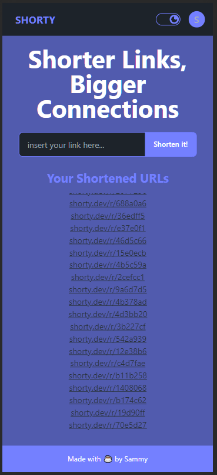

# Shorty #

Simple URL shortener project created as a prove of concept of using Golang with SSR using HTMX

## Demo ##



## Run Locally ##

Start database (users docker-compose)

```bash
make start-database
make migrate-up # migrates the database schema
```

Start asset bundling

```bash
make start-ui
```

Start server

```bash
make start
```

## Features ##

- Authentication using Google OAuth
- Shortener using md5 + random salt to avoid collisions
- Add and list short URLs
- Dark Mode persisted to the database

## Author ##

Shorty is written and maintained by [Samuel Castro](https://www.linkedin.com/in/samuelfvlcastro/).
